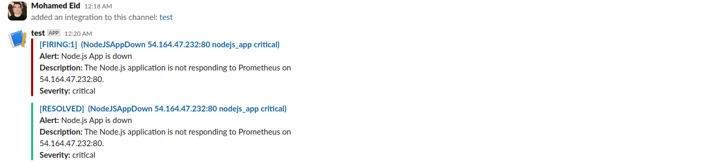
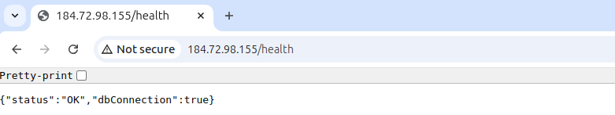

# CI/CD Project with GitHub Actions, Kubernetes, Prometheus, Ansible, and Terraform

This project demonstrates a CI/CD pipeline using GitHub Actions to deploy a Node.js application to Kubernetes and configure monitoring tools like Prometheus, Grafana, and Alertmanager.


---

## Getting Started

### Prerequisites
1. **Set up GitHub Secrets**:


   - Add the following secrets in your GitHub repository:
     - `AWS_ACCESS_KEY_ID`: AWS access key ID.
     - `AWS_SECRET_ACCESS_KEY`: AWS secret access key.
     - `DOCKER_USERNAME`: Docker Hub username.
     - `DOCKER_PASSWORD`: Docker Hub password.
     - `SSH_PRIVATE_KEY`: Private SSH key to access the servers.

2. **User Configuration**:
   - Ensure the user name which will be created on both servers with root privileges set in var.yml

### Usage
1. **Clone the Repository**:
   ```bash
   git clone https://github.com/your-repo/ci-cd-project.git
   cd ci-cd-project
   ```

2. **Push Code**:
   - Push changes to the `master` branch to trigger the CI pipeline.

3. **Monitor Workflows**:
   - Track CI and CD workflows in GitHub Actions.

---

## Project Overview

### CI/CD Workflow
1. **CI Pipeline**:
   - Triggered on code push to the `master` branch.
   - Executes unit tests and endpoint validation.
   - Builds a Docker image for the application and pushes it to Docker Hub.

2. **CD Pipeline**:
   - Triggered after the CI Pipeline is completed.
   - Uses Terraform to provision infrastructure on AWS.
   - Configures the servers using Ansible.
   - Deploys the Node.js application on Kubernetes (2 pods with a service and ingress).
   - Sets up Prometheus, Grafana, and Alertmanager for monitoring and alerting.

---

## Project Structure

```plaintext
.
├── ansible/
│   ├── agent_play.yml          # Playbook for agent node setup
│   ├── prometheus_play.yml     # Playbook for monitoring setup
│   ├── hosts.ini               # Ansible inventory (dynamically updated)
│   ├── vars.yml                # Ansible variables
│   ├── roles/                  # Ansible roles
├── src/
│   ├── app.js                  # Node.js application
│   ├── app.test.js             # Application tests
├── terraform/
│   ├── main.tf                 # Terraform configuration for infrastructure
│   ├── variables.tf            # Terraform variables
├── .github/
│   ├── workflows/
│       ├── ci.yml              # CI pipeline
│       ├── cd.yml              # CD pipeline
├── Dockerfile                  # Dockerfile for building the Node.js app
└── prometheus.yml              # Prometheus configuration
```

---

## Key Features

1. **CI/CD Automation**:
   - GitHub Actions automate testing, building, and deploying the application.

2. **Infrastructure as Code**:
   - Terraform provisions AWS infrastructure dynamically.

3. **Configuration Management**:
   - Ansible automates server configuration and application setup.

4. **Kubernetes Deployment**:
   - Deploys the Node.js app with high availability and ingress support.

5. **Monitoring and Alerting**:
   - Prometheus and Grafana for metrics.
   - Alertmanager configured for Slack alerts.
   - Access grafana with 3000 port and make your data source (Prometheus) finally use Node Exporter Dashboard for ease of use.

## Project Screenshots

1. **Test Targets**
   
---
1. **Test Pending**
   
---
2. **Test Firing**
   
---
2. **Test Slack**
   
---
3. **Test App Main**
   
---
4. **Test App Health**
   
---
5. **Test App Metrics**
   

---

## Author

[Mohamed Eid](https://github.com/moeid404)
